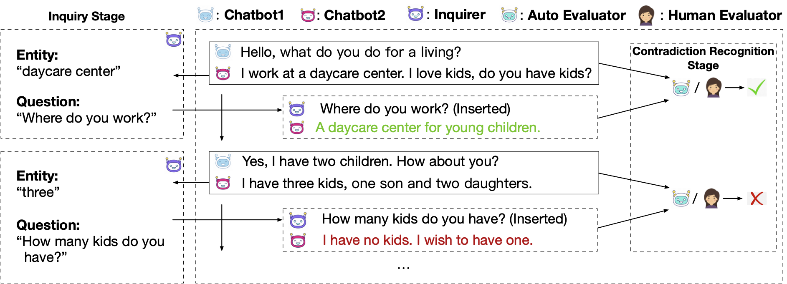

# Addressing Inquiries about History: An Efficient and Practical Framework for Evaluating Open-domain Chatbot Consistency
This repository contains the code for Findings of ACL 2021 paper Addressing Inquiries about History: An Efficient and Practical Framework for Evaluating Open-domain Chatbot Consistency.

Our paper and code will be public soon!

## Overview

We propose the *Addressing Inquiries the History* (**AIH**), an effective and practical framework for open-domain chatbot consistency evaluation. **AIH** contains two stages: (1) during the inquiry stage,  questions about the facts and opinions mentioned in the conversation history are inserted into the conversation between chatbots. (2) during the contradiction recognition stage,  the responses of the inserted questions are collected, and automatic models or human judges can be adopted to decide whether the responses are consistent with the dialogue history.  




## How to Run?

### Entity Extraction & Question Generation

Contradiction usually occurs when chatting about facts or opinions. Contradiction about facts or opinions is really annoying in the human-bot interaction. Therefore, we first extract the name entities from the chatbot2's responses using the stanza toolkit. 

Then, we generate questions based on the extracted entities. We employ text2text (https://github.com/artitw/text2text) as the question generator. 

Please refer to `text2text/deploy.py` for deploying entity extraction and question generation.

### Deploy Chatbots

Deploy several chatbots that can be accessed through interface like http://127.0.0.1:8082/interact. The chatbots should receive contexts and return responses. Note that the responses of generated questions should not be added in contexts. 


### Automatic Evaluation

`NLI/`: Automatic evaluation using Natural Language Inference model (https://huggingface.co/roberta-large-mnli). 

Please refer to `NLI/deploy_NLI.py` for deploying automatic evaluation. 

### Bot Play

After deploying chatbots and entity extraction & question generation, start bot-play.

Please refer to `play.py` for deploying bot play. The results will be saved at `results/`.


## Citation

Please cite our paper if you use **AIH** in your work.

```bibtex
@inproceedings{li2021addressing,
   title={Addressing Inquiries about History: An Efficient and Practical Framework for Evaluating Open-domain Chatbot Consistency},
   author={Li, Zekang and Zhang, Jinchao and Fei, Zhengcong and Feng, Yang and Zhou, Jie},
   booktitle={Findings of Proceedings of the 59th Annual Meeting of the Association for Computational Linguistics},
   year={2021}
}
```

